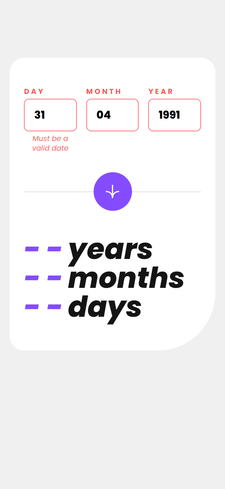
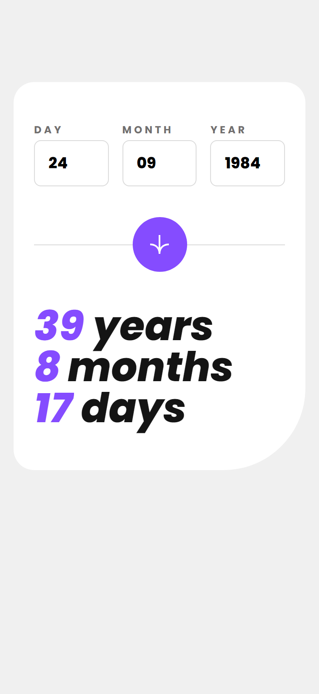

# Frontend Mentor - Age calculator app solution

This is a solution to the [Age calculator app challenge on Frontend Mentor](https://www.frontendmentor.io/challenges/age-calculator-app-dF9DFFpj-Q). Frontend Mentor challenges help you improve your coding skills by building realistic projects.

## Table of contents

- [Overview](#overview)
  - [The challenge](#the-challenge)
  - [Screenshot](#screenshot)
  - [Links](#links)
- [My process](#my-process)
  - [Built with](#built-with)
  - [What I learned](#what-i-learned)
  - [Continued development](#continued-development)
- [Author](#author)

## Overview

This is the second challenge in the **Modern Styling Roadmap**. It is a simple form to calculate one's age. Styling done using **TailwindCSS**.

### The challenge

Users should be able to:

- View an age in years, months, and days after submitting a valid date through the form **(DONE)**
- Receive validation errors if:
  - Any field is empty when the form is submitted **(DONE)**
  - The day number is not between 1-31 **(DONE)**
  - The month number is not between 1-12 **(DONE)**
  - The year is in the future **(DONE)**
  - The date is invalid e.g. 31/04/1991 (there are 30 days in April) **(DONE)**
- View the optimal layout for the interface depending on their device's screen size **(DONE)**
- See hover and focus states for all interactive elements on the page **(DONE)**
- **Bonus**: See the age numbers animate to their final number when the form is submitted **(DONE)**

### Screenshot

#### Mobile

##### Mobile Initial

##### Mobile Empty Form

##### Mobile Form Errors

##### Mobile Invalid Date Error

##### Mobile Completed

##### Mobile Completed Active

#### Desktop

##### Desktop Initial

##### Desktop Empty Form

##### Desktop Form Errors

##### Desktop Invalid Date Error

##### Desktop Completed

##### Desktop Completed Active

### Links

- Solution URL: [Solution URL](https://www.frontendmentor.io/solutions/age-calculator-app-P2Rbj02ZN_)
- Live Site URL: [Live Site URL](https://frontendmentor-ilyesab.github.io/age-calculator-app/)

## My process

### Built with

- Semantic HTML5 markup
- CSS custom properties
- Flexbox
- CSS Grid
- Mobile-first workflow
- [React](https://reactjs.org/) - JS library
- [Next.js](https://nextjs.org/) - React framework
- [TypeScript](https://www.typescriptlang.org/) - Type Checking Language Built on top of Javascript.
- [TailwindCSS](https://tailwindcss.com/) - A utility-first CSS framework

### What I learned

I had a lot of trouble completing this challenge. I used a mix of **Constraint Validation API** and my own validation to report on errors as it seems I couldn't implement all the error checking using the built in options of the input element. This made me think about how I should consult and learn about form validation libraries as it was quite cumbersome to implement the validation myself.

I used the **[React Animated Numbers](https://www.npmjs.com/package/react-animated-numbers)** library for the numbers animation. but since the font used on this project doesn't support numbers of the same width. e.g. it's not a monospace font nor does it support **font-variant-numeric: tabular-nums**. so I had to write some unconventional code to solve the spacing issue between numbers. The library also uses framer motion behind and since I have no experience with it I didn't really customize the animation.

All in all was very fun to work on the project. it just highlighted a lot of areas of weakness on my side.

### Continued development

I'd like to consult and search libraries that might have made this project easier to make.

## Author

- Frontend Mentor - [@ilyesab](https://www.frontendmentor.io/profile/ilyesab)
